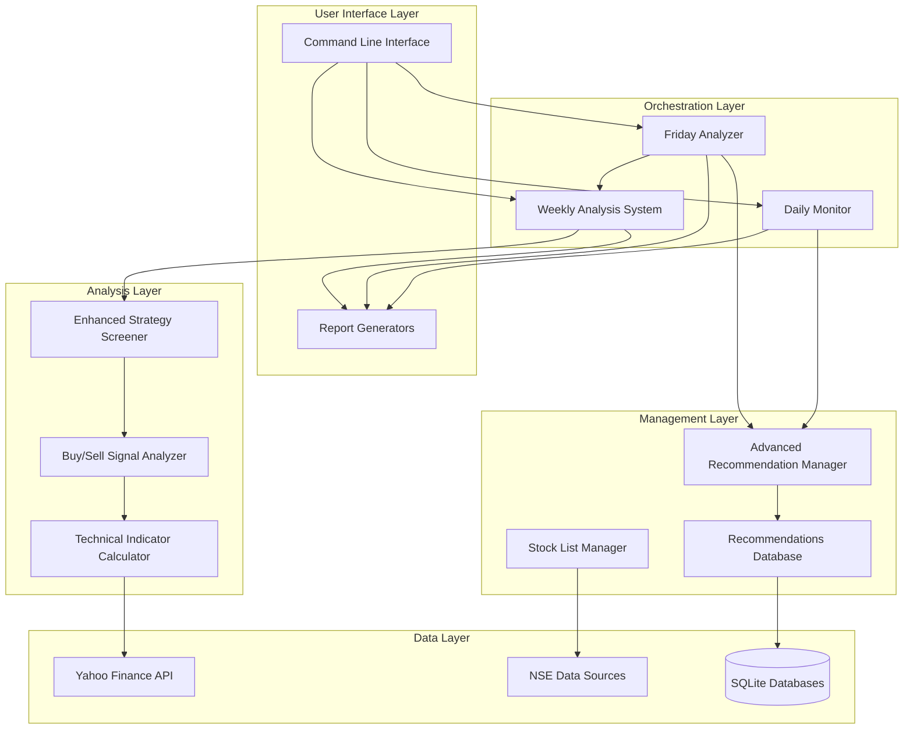
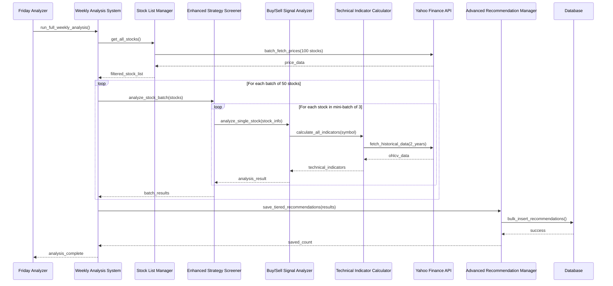
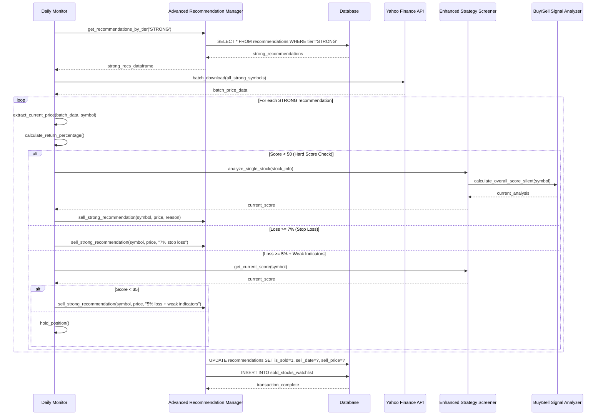
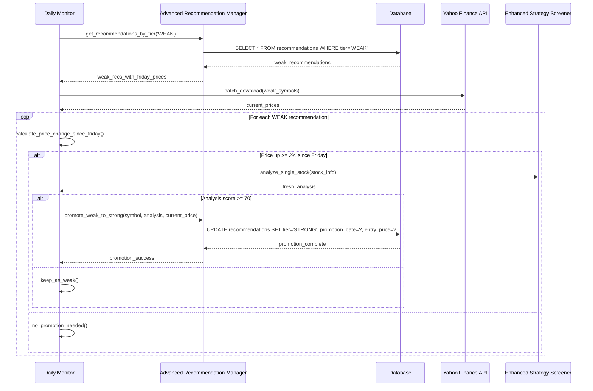
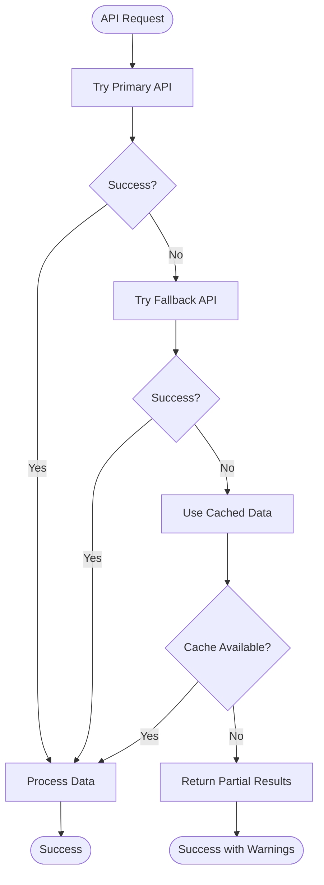
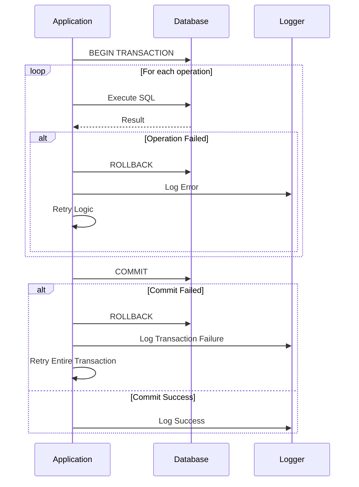

# Component Interactions and Data Flow Documentation

## 1. Component Interaction Overview

### 1.1 System Component Map



### 1.2 Component Interaction Matrix

| Component | Interacts With | Interaction Type | Data Exchanged |
|-----------|----------------|------------------|----------------|
| Daily Monitor | Advanced Recommendation Manager | Method Calls | Recommendation updates, sell orders |
| Daily Monitor | Enhanced Strategy Screener | Method Calls | Stock analysis requests |
| Friday Analyzer | Weekly Analysis System | Method Calls | Analysis triggers |
| Friday Analyzer | Advanced Recommendation Manager | Method Calls | Cleanup operations |
| Weekly Analysis System | Enhanced Strategy Screener | Method Calls | Batch stock screening |
| Enhanced Strategy Screener | Buy/Sell Signal Analyzer | Method Calls | Individual stock analysis |
| Buy/Sell Signal Analyzer | Technical Indicator Calculator | Method Calls | Technical indicator data |
| Advanced Recommendation Manager | Recommendations Database | SQL Operations | CRUD operations |
| Stock List Manager | NSE Data Sources | HTTP Requests | Stock lists and metadata |
| Technical Indicator Calculator | Yahoo Finance API | HTTP Requests | Historical price data |

## 2. Detailed Component Interactions

### 2.1 Daily Monitor Interactions

#### 2.1.1 Daily Monitor → Advanced Recommendation Manager
```python
# Interaction Pattern: Direct Method Calls
class DailyMonitor:
    def monitor_strong_recommendations(self):
        # Get recommendations
        strong_recs = self.manager.get_recommendations_by_tier('STRONG')
        
        # Process selling decisions
        for rec in strong_recs:
            if self.should_sell(rec):
                self.manager.sell_strong_recommendation(
                    symbol=rec['symbol'],
                    current_price=current_price,
                    reason=sell_reason
                )
    
    def check_weak_promotions(self):
        # Get WEAK recommendations
        weak_recs = self.manager.get_recommendations_by_tier('WEAK')
        
        # Process promotions
        for rec in weak_recs:
            if self.should_promote(rec):
                self.manager.promote_weak_to_strong(
                    symbol=rec['symbol'],
                    new_analysis=analysis,
                    current_price=current_price
                )
```

**Data Flow:**
- **Input**: Tier-based recommendation queries
- **Output**: Sell orders, promotion requests, performance updates
- **Frequency**: Daily (Monday-Thursday)

#### 2.1.2 Daily Monitor → Enhanced Strategy Screener
```python
# Interaction Pattern: Analysis Requests
class DailyMonitor:
    def get_current_score(self, symbol, current_price):
        stock_info = {
            'symbol': symbol,
            'current_price': current_price,
            'company_name': company_name,
            'sector': sector
        }
        
        # Request fresh analysis
        analysis = self.screener.analyze_single_stock(stock_info)
        return analysis['total_score'] if analysis else None
```

**Data Flow:**
- **Input**: Stock information for re-analysis
- **Output**: Current technical analysis scores
- **Purpose**: Real-time decision making for sells/promotions

### 2.2 Friday Analyzer Interactions

#### 2.2.1 Friday Analyzer → Weekly Analysis System
```python
# Interaction Pattern: Orchestration
class FridayAnalyzer:
    def run_weekly_analysis(self):
        # Trigger comprehensive weekly analysis
        results = self.weekly_system.run_full_weekly_analysis(
            min_score=35, 
            batch_size=100
        )
        
        # Process and classify results
        for result in results:
            tier = self.classify_tier(result['total_score'])
            self.manager.save_tiered_recommendation(
                symbol=result['symbol'],
                analysis_result=result,
                stock_info=result['stock_info'],
                tier=tier,
                force_update=True
            )
```

**Data Flow:**
- **Input**: Analysis parameters (min_score, batch_size)
- **Output**: Comprehensive analysis results for all NSE stocks
- **Frequency**: Weekly (Friday)

#### 2.2.2 Friday Analyzer → Advanced Recommendation Manager
```python
# Interaction Pattern: Cleanup Operations
class FridayAnalyzer:
    def cleanup_strong_recommendations(self):
        # Get all STRONG positions
        strong_recs = self.manager.get_recommendations_by_tier('STRONG')
        
        # Apply cleanup criteria
        for rec in strong_recs:
            if self.should_cleanup(rec):
                self.manager.sell_strong_recommendation(
                    symbol=rec['symbol'],
                    current_price=current_price,
                    reason=cleanup_reason
                )
```

**Data Flow:**
- **Input**: STRONG recommendation data
- **Output**: Cleanup sell orders
- **Purpose**: Weekly portfolio maintenance

### 2.3 Analysis Layer Interactions

#### 2.3.1 Enhanced Strategy Screener → Buy/Sell Signal Analyzer
```python
# Interaction Pattern: Individual Stock Analysis
class EnhancedStrategyScreener:
    def analyze_single_stock(self, stock_info):
        symbol = stock_info['symbol']
        yahoo_symbol = f"{symbol}.NS"
        
        # Request comprehensive analysis
        result = self.analyzer.calculate_overall_score_silent(yahoo_symbol)
        
        if result:
            result['stock_info'] = stock_info
            result['symbol'] = symbol
            
        return result
```

**Data Flow:**
- **Input**: Stock metadata (symbol, price, company info)
- **Output**: Comprehensive analysis with weighted scores
- **Processing**: Individual stock technical analysis

#### 2.3.2 Buy/Sell Signal Analyzer → Technical Indicator Calculator
```python
# Interaction Pattern: Technical Data Request
class BuySellSignalAnalyzer:
    def calculate_overall_score_silent(self, symbol):
        # Single API call for all indicators
        results = calculate_all_indicators(symbol)
        
        if results is None:
            return None
        
        # Process each analysis category
        trend_score, trend_signals = self.analyze_trend_signals(results)
        momentum_score, momentum_signals = self.analyze_momentum_signals(results)
        rsi_score, rsi_signals = self.analyze_rsi_signals(results)
        volume_score, volume_signals = self.analyze_volume_signals(results)
        price_score, price_signals = self.analyze_price_action_signals(results)
        
        # Calculate weighted final score
        total_score = self.calculate_weighted_score(
            trend_score, momentum_score, rsi_score, volume_score, price_score
        )
        
        return self.format_analysis_result(total_score, signals)
```

**Data Flow:**
- **Input**: Stock symbol
- **Output**: Complete technical indicator dataset
- **Optimization**: Single API call for all indicators (9x performance improvement)

### 2.4 Data Layer Interactions

#### 2.4.1 Technical Indicator Calculator → Yahoo Finance API
```python
# Interaction Pattern: Batch API Requests
def calculate_all_indicators(symbol):
    try:
        # SINGLE API CALL - Fetch 2 years of data once
        stock = yf.Ticker(symbol)
        data = stock.history(period="2y")
        
        if data.empty:
            return None
        
        # Calculate all indicators from this single dataset
        return calculate_all_indicators_from_data(data)
        
    except Exception as e:
        return None
```

**Data Flow:**
- **Input**: Stock symbol with .NS suffix
- **Output**: 2 years of OHLCV data
- **Optimization**: Single API call per stock instead of multiple calls per indicator

#### 2.4.2 Stock List Manager → NSE Data Sources
```python
# Interaction Pattern: Multi-Source Fallback
class StockListManager:
    def get_stock_list(self, force_refresh=False):
        # Try multiple sources with fallbacks
        sources = [
            self._fetch_from_nse,
            self._fetch_from_nse_alternative,
            self._fetch_nse_indices,
            self._get_curated_list
        ]
        
        for source in sources:
            try:
                stocks_data = source()
                if len(stocks_data) > 10:
                    return self.process_and_cache(stocks_data)
            except Exception as e:
                continue
        
        return self._get_basic_list()
```

**Data Flow:**
- **Input**: HTTP requests to NSE endpoints
- **Output**: Stock lists with metadata (ISIN, series, listing date)
- **Resilience**: Multiple fallback sources for reliability

## 3. Data Flow Patterns

### 3.1 Weekly Analysis Data Flow



### 3.2 Daily Monitoring Data Flow



### 3.3 Promotion Data Flow (WEAK → STRONG)



## 4. Error Handling and Recovery Flows

### 4.1 API Failure Recovery Flow



### 4.2 Database Transaction Recovery



## 5. Performance Optimization Patterns

### 5.1 Batch Processing Pattern

```python
# Before: Individual API calls (slow)
def process_stocks_individually(symbols):
    results = []
    for symbol in symbols:
        data = yf.download(f"{symbol}.NS", period="1d")  # Individual API call
        if not data.empty:
            results.append(process_single_stock(symbol, data))
    return results

# After: Batch API calls (10-17x faster)
def process_stocks_in_batch(symbols):
    yahoo_symbols = [f"{symbol}.NS" for symbol in symbols]
    
    # Single API call for all symbols
    batch_data = yf.download(" ".join(yahoo_symbols), period="1d", group_by='ticker')
    
    results = []
    for symbol in symbols:
        stock_data = extract_from_batch(batch_data, f"{symbol}.NS")
        if stock_data is not None:
            results.append(process_single_stock(symbol, stock_data))
    
    return results
```

### 5.2 Database Connection Pooling

```python
class DatabaseConnectionManager:
    def __init__(self, db_name, pool_size=5):
        self.db_name = db_name
        self.pool = queue.Queue(maxsize=pool_size)
        
        # Pre-populate connection pool
        for _ in range(pool_size):
            conn = sqlite3.connect(db_name, check_same_thread=False)
            self.pool.put(conn)
    
    @contextmanager
    def get_connection(self):
        conn = self.pool.get()
        try:
            yield conn
        finally:
            self.pool.put(conn)
    
    def execute_batch(self, operations):
        with self.get_connection() as conn:
            cursor = conn.cursor()
            try:
                for operation in operations:
                    cursor.execute(operation['query'], operation['params'])
                conn.commit()
                return True
            except Exception as e:
                conn.rollback()
                raise e
```

## 6. Component Communication Protocols

### 6.1 Synchronous Communication
- **Method**: Direct function calls
- **Use Cases**: Real-time analysis, immediate decision making
- **Components**: Daily Monitor ↔ Recommendation Manager
- **Advantages**: Simple, immediate response
- **Disadvantages**: Blocking operations

### 6.2 Database-Mediated Communication
- **Method**: Shared database state
- **Use Cases**: Persistent data sharing, historical tracking
- **Components**: All components ↔ Database layer
- **Advantages**: Persistent, ACID compliant
- **Disadvantages**: Potential bottleneck

### 6.3 Batch Communication
- **Method**: Bulk data processing
- **Use Cases**: Weekly analysis, performance updates
- **Components**: Weekly Analysis System ↔ External APIs
- **Advantages**: High throughput, efficient
- **Disadvantages**: Higher latency

This comprehensive documentation shows how all components in your stock monitoring system interact with each other, the data flow patterns, and the communication protocols used throughout the system.