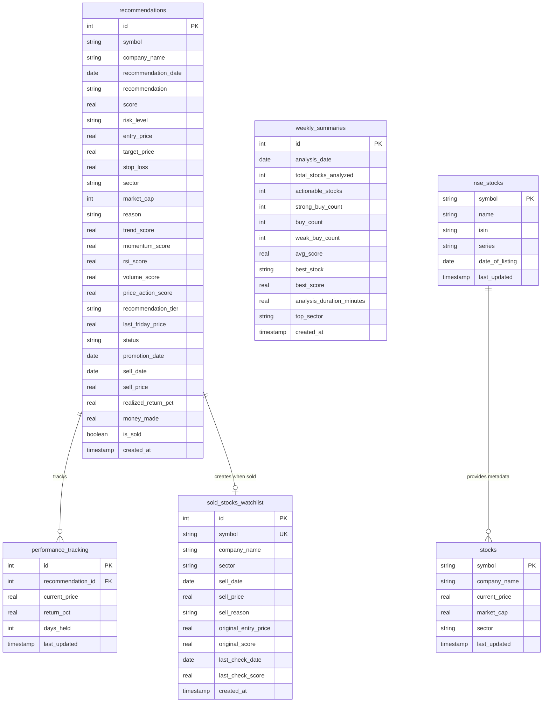
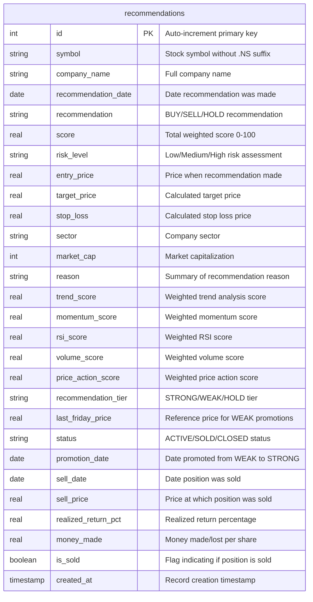
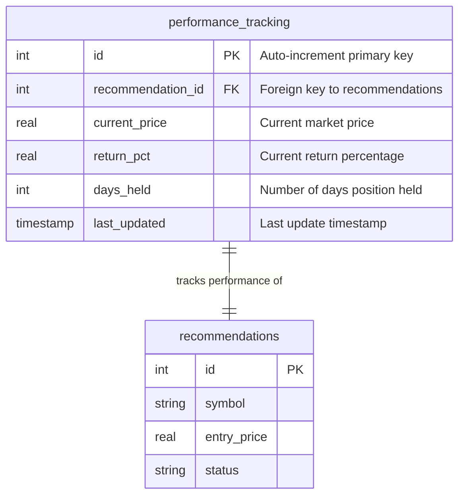
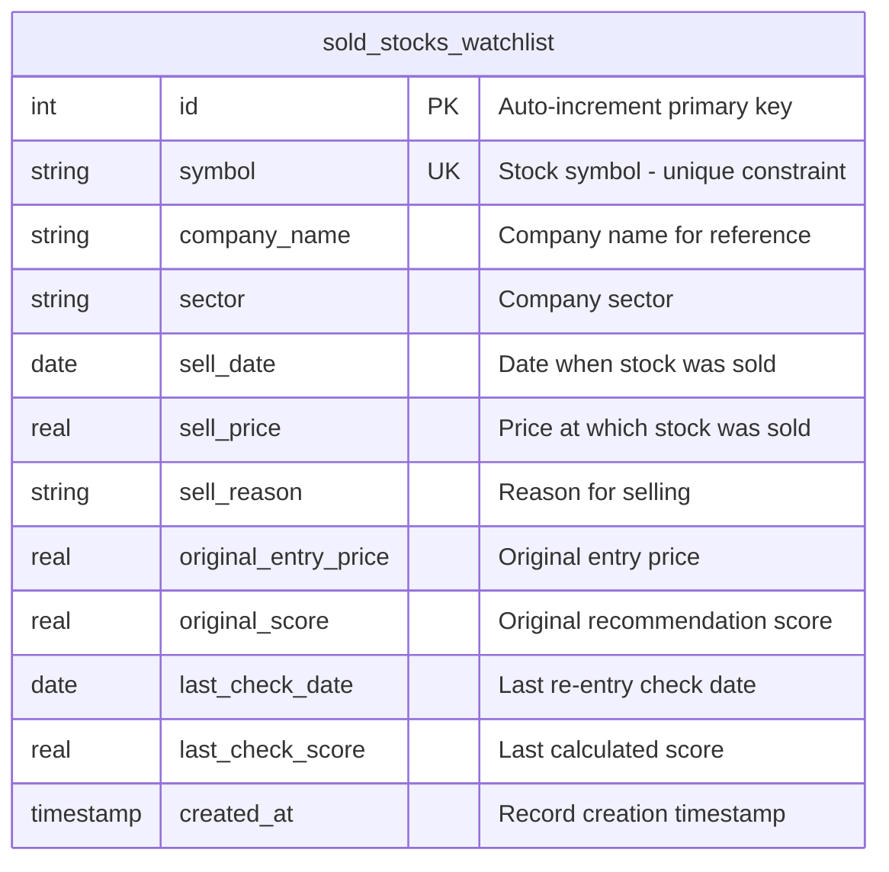
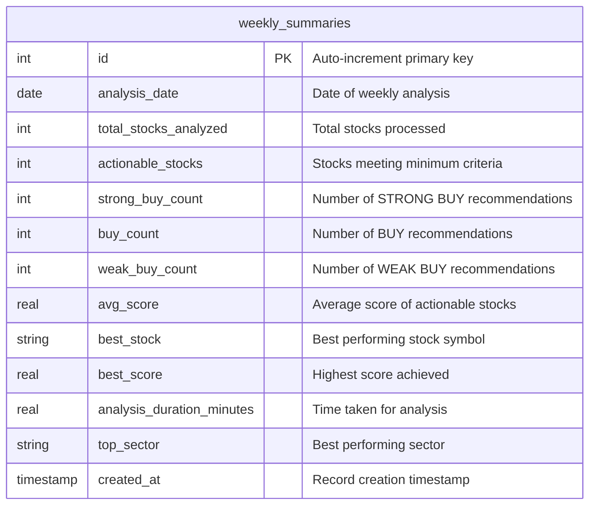
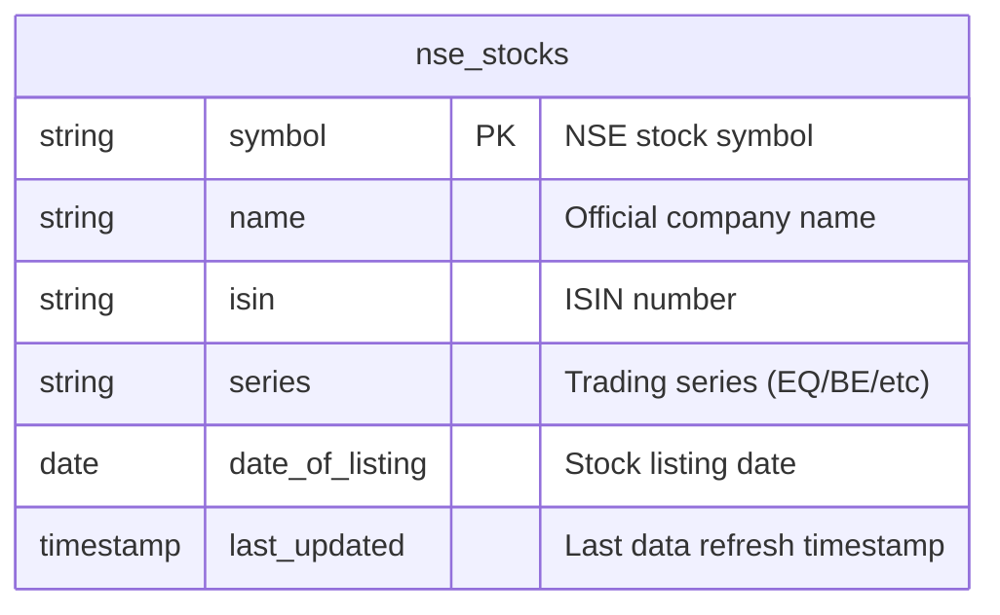
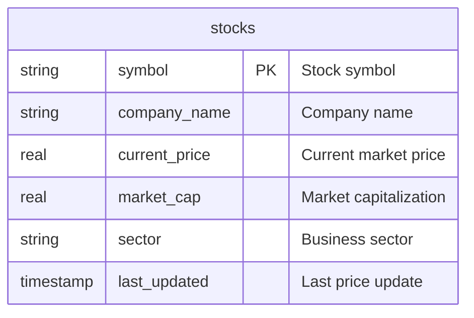
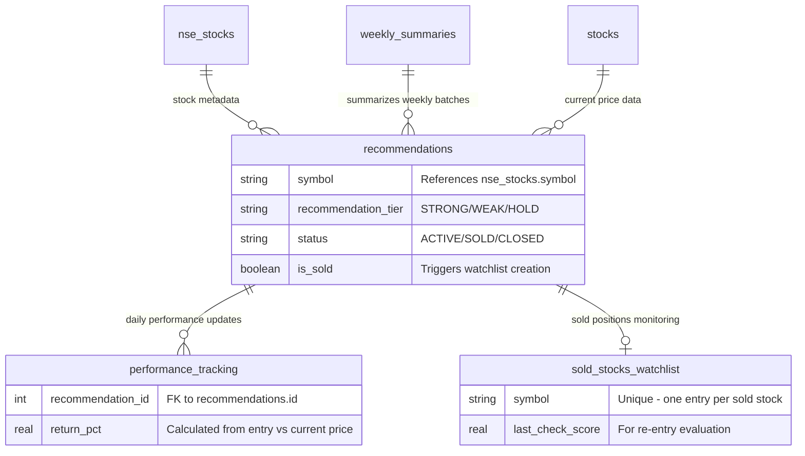
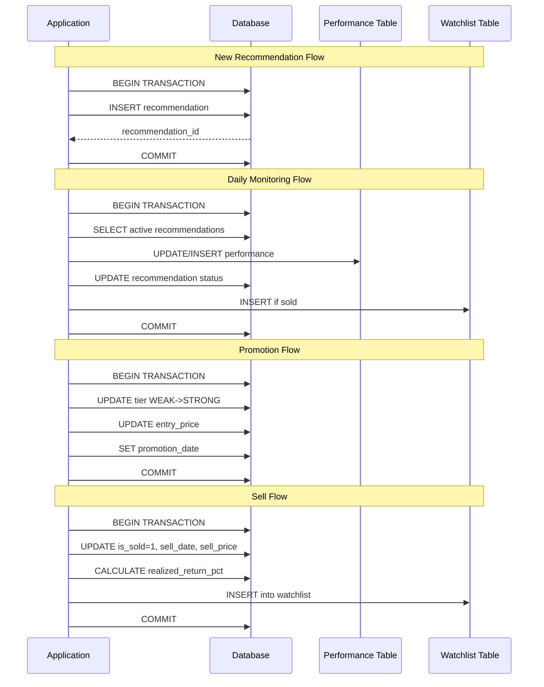

# Database Entity-Relationship Diagrams

## 1. Complete Database Schema Overview



## 2. Main Recommendations Table Schema



## 3. Performance Tracking Schema



## 4. Sold Stocks Watchlist Schema



## 5. Weekly Analysis Summary Schema



## 6. NSE Stocks Master Data Schema



## 7. Stock Scanner Database Schema



## 8. Data Relationships and Flow



## 9. Database Indexes and Constraints

```mermaid
erDiagram
    indexes_and_constraints {
        string table_name
        string constraint_type
        string constraint_details
    }
    
    indexes_and_constraints {
        recommendations "PRIMARY KEY" "id (auto-increment)"
        recommendations "UNIQUE INDEX" "symbol + recommendation_tier + status"
        recommendations "INDEX" "recommendation_date"
        recommendations "INDEX" "recommendation_tier"
        recommendations "INDEX" "status"
        recommendations "INDEX" "is_sold"
        performance_tracking "PRIMARY KEY" "id (auto-increment)"
        performance_tracking "FOREIGN KEY" "recommendation_id -> recommendations.id"
        performance_tracking "INDEX" "recommendation_id"
        sold_stocks_watchlist "PRIMARY KEY" "id (auto-increment)"
        sold_stocks_watchlist "UNIQUE" "symbol"
        sold_stocks_watchlist "INDEX" "sell_date"
        nse_stocks "PRIMARY KEY" "symbol"
        nse_stocks "INDEX" "symbol"
        stocks "PRIMARY KEY" "symbol"
        weekly_summaries "PRIMARY KEY" "id (auto-increment)"
        weekly_summaries "INDEX" "analysis_date"
    }
```

## 10. Data Object Models

### Recommendation Data Object
```python
class RecommendationData:
    id: int
    symbol: str
    company_name: str
    recommendation_date: date
    recommendation: str  # "🟢 STRONG BUY", "🟢 BUY", "🟡 WEAK BUY", "⚪ HOLD", "🔴 SELL"
    score: float  # 0-100
    risk_level: str  # "Low", "Medium", "High"
    entry_price: float
    target_price: float
    stop_loss: float
    sector: str
    market_cap: int
    reason: str
    
    # Signal breakdown scores
    trend_score: float
    momentum_score: float
    rsi_score: float
    volume_score: float
    price_action_score: float
    
    # Tier management
    recommendation_tier: str  # "STRONG", "WEAK", "HOLD"
    last_friday_price: float
    status: str  # "ACTIVE", "SOLD", "CLOSED"
    
    # Lifecycle tracking
    promotion_date: Optional[date]
    sell_date: Optional[date]
    sell_price: Optional[float]
    realized_return_pct: Optional[float]
    money_made: Optional[float]
    is_sold: bool
    created_at: datetime
```

### Performance Tracking Data Object
```python
class PerformanceData:
    id: int
    recommendation_id: int
    current_price: float
    return_pct: float
    days_held: int
    last_updated: datetime
```

### Sold Stock Watchlist Data Object
```python
class SoldStockWatchlistData:
    id: int
    symbol: str
    company_name: str
    sector: str
    sell_date: date
    sell_price: float
    sell_reason: str
    original_entry_price: float
    original_score: float
    last_check_date: Optional[date]
    last_check_score: Optional[float]
    created_at: datetime
```

### Technical Analysis Data Object
```python
class TechnicalAnalysisData:
    # Moving Averages
    dma_50: Dict[str, Any]  # current_value, trend, weekly_data
    dma_200: Dict[str, Any]
    
    # Momentum Indicators
    weekly_macd: Dict[str, Any]  # macd_line, signal_line, crossovers
    
    # Oscillators
    weekly_rsi: Dict[str, Any]  # current_value, conditions, weekly_data
    
    # Volume Indicators
    obv: Dict[str, Any]  # current_value, trend_percentage, weekly_data
    vpt: Dict[str, Any]
    
    # Price Action
    weekly_prices: Dict[str, Any]  # closes, changes, volatility
    price_change_5d: float
    price_change_10d: float
    price_change_6m: float
```

### Signal Analysis Data Object
```python
class SignalAnalysisData:
    total_score: float  # 0-100
    recommendation: str
    risk_level: str
    
    breakdown: Dict[str, Dict[str, Any]] = {
        'trend': {
            'raw': float,
            'weighted': float,
            'signals': List[str]
        },
        'momentum': {
            'raw': float,
            'weighted': float,
            'signals': List[str]
        },
        'rsi': {
            'raw': float,
            'weighted': float,
            'signals': List[str]
        },
        'volume': {
            'raw': float,
            'weighted': float,
            'signals': List[str]
        },
        'price': {
            'raw': float,
            'weighted': float,
            'signals': List[str]
        }
    }
```

## 11. Database Transaction Patterns



This comprehensive ER diagram documentation shows all the database schemas, relationships, data objects, and transaction patterns used in your stock monitoring and recommendation system.