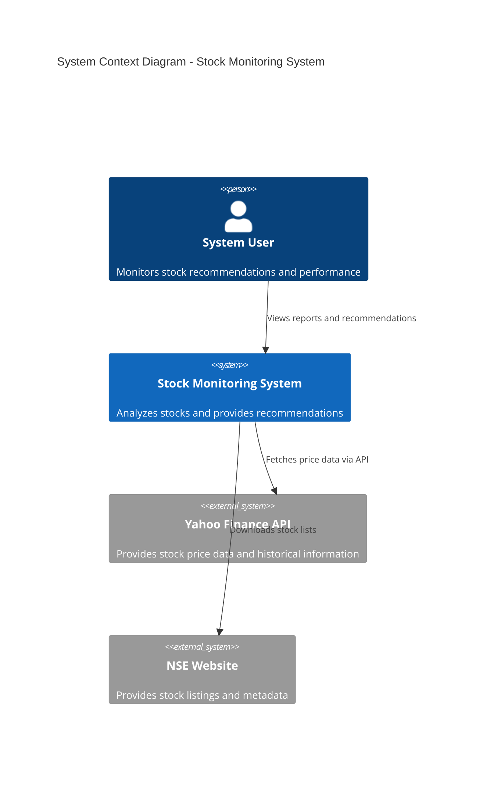
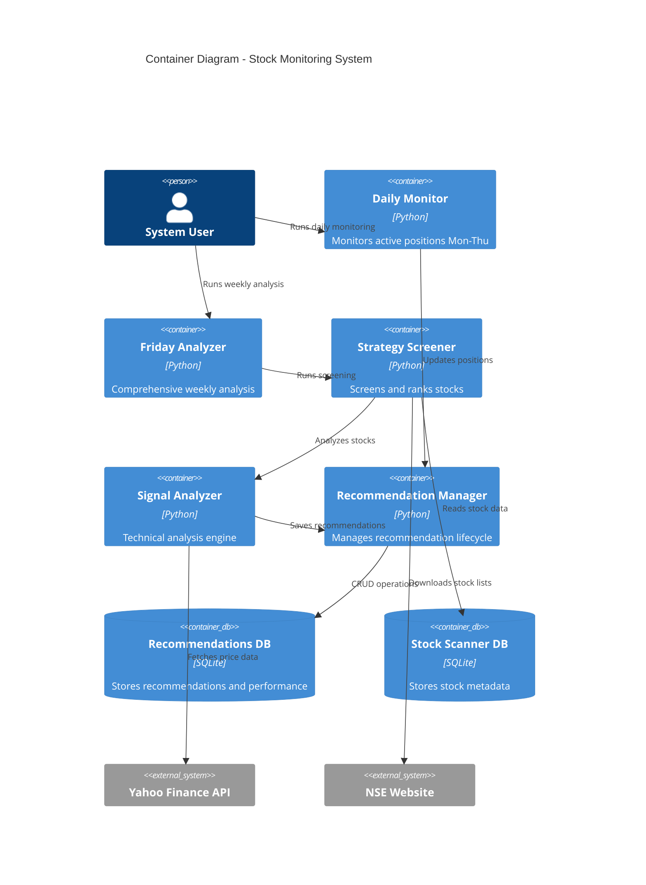

# High Level Design (HLD) - Stock Monitoring & Recommendation System

## 1. System Overview

### 1.1 Purpose
The Stock Monitoring & Recommendation System is a comprehensive automated platform that analyzes NSE stocks using technical indicators, provides tiered recommendations (STRONG/WEAK/HOLD), and continuously monitors positions with automated buy/sell decisions.

### 1.2 Scope
- **Coverage**: ~1,288 NSE stocks
- **Analysis Frequency**: Daily monitoring (Mon-Thu), Weekly comprehensive analysis (Friday)
- **Recommendation Tiers**: STRONG (Score ≥70), WEAK (Score 50-69), HOLD (Score <50)
- **Automation Level**: Fully automated with minimal manual intervention

### 1.3 Key Objectives
- Provide data-driven stock recommendations using technical analysis
- Automate daily monitoring of active positions
- Implement risk management through tiered recommendations
- Optimize performance through batch processing
- Maintain comprehensive historical tracking

## 2. System Architecture

### 2.1 Architecture Style
**Modular Monolithic Architecture** with the following characteristics:
- **Modular Components**: Loosely coupled modules with specific responsibilities
- **Shared Database**: Centralized SQLite database for all components
- **Batch Processing**: Optimized for high-throughput data processing
- **Event-Driven**: Time-based triggers (daily/weekly schedules)

### 2.2 System Context Diagram



### 2.3 Container Diagram



## 3. Component Architecture

### 3.1 Core Components

#### 3.1.1 Daily Monitor Component
- **Responsibility**: Monday-Thursday position monitoring
- **Key Functions**:
  - Monitor STRONG recommendations for selling criteria
  - Check WEAK recommendations for promotion opportunities
  - Monitor sold stocks for re-entry
  - Update performance metrics
- **Performance**: Batch processing (10x faster than individual requests)

#### 3.1.2 Friday Analyzer Component
- **Responsibility**: Weekly comprehensive analysis and cleanup
- **Key Functions**:
  - Clean up underperforming STRONG positions
  - Update Friday reference prices for WEAK positions
  - Trigger full weekly analysis
  - Generate weekly performance reports
- **Integration**: Orchestrates weekly analysis workflow

#### 3.1.3 Technical Indicator Calculator
- **Responsibility**: Core technical analysis engine
- **Key Functions**:
  - Calculate moving averages (50-day, 200-day DMA)
  - Compute momentum indicators (MACD)
  - Analyze oscillators (RSI)
  - Process volume indicators (OBV, VPT)
- **Optimization**: Single API call per stock (9x performance improvement)

#### 3.1.4 Buy/Sell Signal Analyzer
- **Responsibility**: Sophisticated signal analysis and scoring
- **Key Functions**:
  - Weighted multi-factor analysis (5 categories)
  - Signal strength calculation
  - Risk assessment
  - Recommendation generation
- **Algorithm**: Weighted scoring system totaling 100 points

#### 3.1.5 Enhanced Strategy Screener
- **Responsibility**: Stock screening and ranking
- **Key Functions**:
  - Screen stocks from NSE database
  - Parallel processing with threading
  - Rank stocks by signal strength
  - Filter by minimum score thresholds
- **Scalability**: Configurable worker threads and batch sizes

#### 3.1.6 Advanced Recommendation Manager
- **Responsibility**: Recommendation lifecycle management
- **Key Functions**:
  - Tiered recommendation classification
  - Promotion logic (WEAK → STRONG)
  - Selling logic with stop-loss criteria
  - Performance tracking and reporting
- **Data Management**: CRUD operations with duplicate prevention

### 3.2 Supporting Components

#### 3.2.1 Stock List Manager
- **Responsibility**: NSE stock list management
- **Key Functions**:
  - Multi-source stock list fetching
  - Database caching with fallbacks
  - Stock metadata management
- **Resilience**: Multiple fallback sources for reliability

#### 3.2.2 Weekly Analysis System
- **Responsibility**: Comprehensive weekly stock analysis
- **Key Functions**:
  - Batch processing of ~1,288 stocks
  - Sector performance analysis
  - Historical trend tracking
- **Performance**: Pure batch requests (17x faster)

#### 3.2.3 Recommendations Database
- **Responsibility**: Database abstraction layer
- **Key Functions**:
  - Database schema management
  - Performance tracking
  - Historical data maintenance
- **Features**: ACID compliance, constraint handling

## 4. Data Architecture

### 4.1 Data Storage Strategy
- **Primary Database**: SQLite for recommendations and performance
- **Secondary Database**: SQLite for stock metadata and scanner data
- **Caching Strategy**: Database-first with API fallbacks
- **Backup Strategy**: Multiple database files for different purposes

### 4.2 Data Flow Patterns

#### 4.2.1 Weekly Analysis Data Flow
```
NSE Stock List → Batch Price Fetch → Technical Analysis → Signal Analysis → Tiered Classification → Database Storage
```

#### 4.2.2 Daily Monitoring Data Flow
```
Active Recommendations → Batch Price Update → Criteria Evaluation → Action Execution → Database Update → Report Generation
```

### 4.3 Data Models

#### 4.3.1 Core Entities
- **Recommendation**: Primary entity with full lifecycle tracking
- **Performance**: Time-series performance data
- **Watchlist**: Sold stocks monitoring for re-entry
- **Stock Metadata**: NSE stock information

#### 4.3.2 Relationships
- One-to-Many: Recommendation → Performance records
- One-to-One: Sold Recommendation → Watchlist entry
- Many-to-One: Recommendations → Stock metadata

## 5. Integration Architecture

### 5.1 External System Integration

#### 5.1.1 Yahoo Finance API
- **Purpose**: Primary data source for stock prices
- **Integration Pattern**: Batch API calls
- **Rate Limiting**: ~2,000 requests/hour
- **Error Handling**: Retry logic with exponential backoff

#### 5.1.2 NSE Website Integration
- **Purpose**: Stock list and metadata
- **Integration Pattern**: Web scraping with fallbacks
- **Data Format**: CSV parsing
- **Resilience**: Multiple endpoint fallbacks

### 5.2 Internal Component Integration

#### 5.2.1 Synchronous Integration
- Direct method calls between components
- Shared database access
- In-memory data passing

#### 5.2.2 Data Integration
- SQLite database as integration hub
- Standardized data models
- Transaction-based consistency

## 6. Performance Architecture

### 6.1 Performance Optimization Strategies

#### 6.1.1 Batch Processing
- **Implementation**: Group multiple stocks in single API calls
- **Performance Gain**: 10-17x faster than individual requests
- **Memory Management**: Process in configurable batch sizes

#### 6.1.2 Parallel Processing
- **Threading**: Limited worker threads (2-5) to respect API limits
- **Async Operations**: Concurrent futures for I/O operations
- **Load Balancing**: Smart delay distribution

#### 6.1.3 Database Optimization
- **Indexing**: Strategic indexes on frequently queried columns
- **Connection Management**: Proper connection lifecycle
- **Query Optimization**: Efficient SQL queries with proper joins

### 6.2 Scalability Considerations

#### 6.2.1 Current Limitations
- Single-threaded API constraints
- SQLite concurrent access limitations
- Memory usage for large batch operations

#### 6.2.2 Scaling Strategies
- Database migration to PostgreSQL for multi-user scenarios
- Distributed processing with multiple API keys
- Cloud deployment for horizontal scaling

## 7. Security Architecture

### 7.1 Data Security
- **Local Storage**: SQLite files stored locally
- **No Sensitive Data**: No personal or financial credentials stored
- **Access Control**: File-system level security

### 7.2 API Security
- **Rate Limiting**: Respect external API limits
- **User-Agent Management**: Proper headers for web scraping
- **Session Management**: Appropriate session handling

### 7.3 Error Handling Security
- **Input Validation**: Validate all external data
- **SQL Injection Prevention**: Parameterized queries
- **Exception Handling**: Graceful error handling without data exposure

## 8. Deployment Architecture

### 8.1 Deployment Model
- **Single Machine Deployment**: Python application with local databases
- **Scheduling**: Cron jobs or task scheduler for automated execution
- **Dependencies**: Python packages managed via requirements.txt

### 8.2 Environment Configuration
- **Development**: Local development with test databases
- **Production**: Scheduled execution with production databases
- **Configuration Management**: Environment-specific settings

### 8.3 Monitoring and Logging
- **Application Logging**: Console output with structured logging
- **Performance Monitoring**: Execution time tracking
- **Error Monitoring**: Exception logging with context

## 9. Quality Attributes

### 9.1 Performance
- **Throughput**: Process ~1,288 stocks in 45-60 minutes
- **Response Time**: Batch operations complete within acceptable timeframes
- **Resource Usage**: Optimized memory usage through batch processing

### 9.2 Reliability
- **Availability**: High availability through fallback mechanisms
- **Error Recovery**: Graceful degradation with partial results
- **Data Consistency**: ACID transactions for data integrity

### 9.3 Maintainability
- **Modularity**: Clear separation of concerns
- **Documentation**: Comprehensive code and system documentation
- **Testing**: Unit tests for critical components

### 9.4 Scalability
- **Horizontal Scaling**: Potential for distributed processing
- **Vertical Scaling**: Efficient resource utilization
- **Data Scaling**: Database optimization for large datasets

## 10. Technology Stack

### 10.1 Core Technologies
- **Programming Language**: Python 3.x
- **Database**: SQLite (with PostgreSQL migration path)
- **Data Processing**: pandas, numpy
- **API Integration**: requests, yfinance
- **Concurrency**: concurrent.futures, threading

### 10.2 Technical Analysis Libraries
- **Primary**: pandas_ta (with manual fallbacks)
- **Visualization**: matplotlib
- **Data Manipulation**: pandas DataFrame operations

### 10.3 Infrastructure
- **Operating System**: Cross-platform (Windows, macOS, Linux)
- **Scheduling**: OS-level task scheduling
- **Storage**: Local file system

## 11. Future Enhancements

### 11.1 Short-term Enhancements
- Real-time price monitoring
- Mobile notifications for critical events
- Enhanced visualization dashboards

### 11.2 Long-term Enhancements
- Machine learning integration for pattern recognition
- Multi-market support (BSE, international markets)
- Portfolio optimization algorithms
- Cloud-based deployment with web interface

This High Level Design provides a comprehensive overview of the system architecture, focusing on the major components, their interactions, and the overall design principles that guide the implementation.