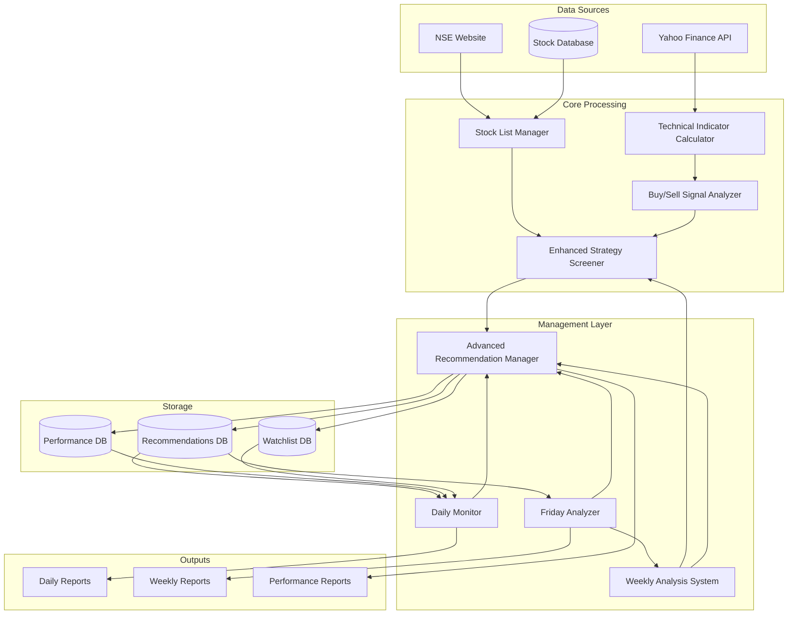
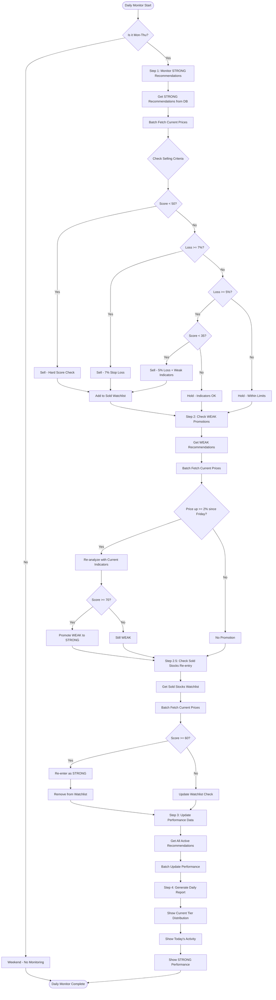
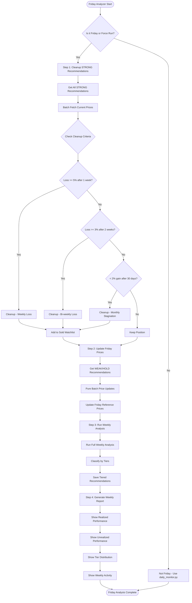
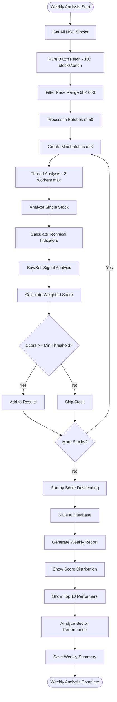
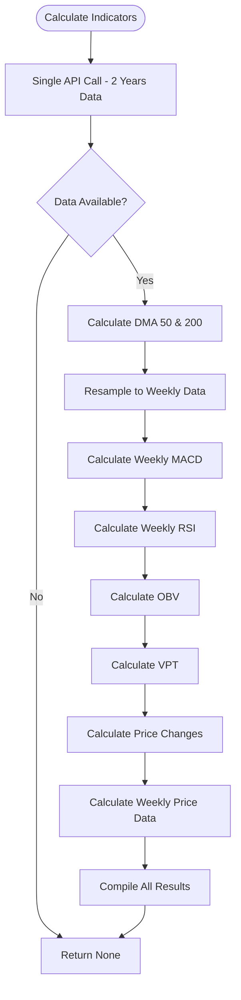
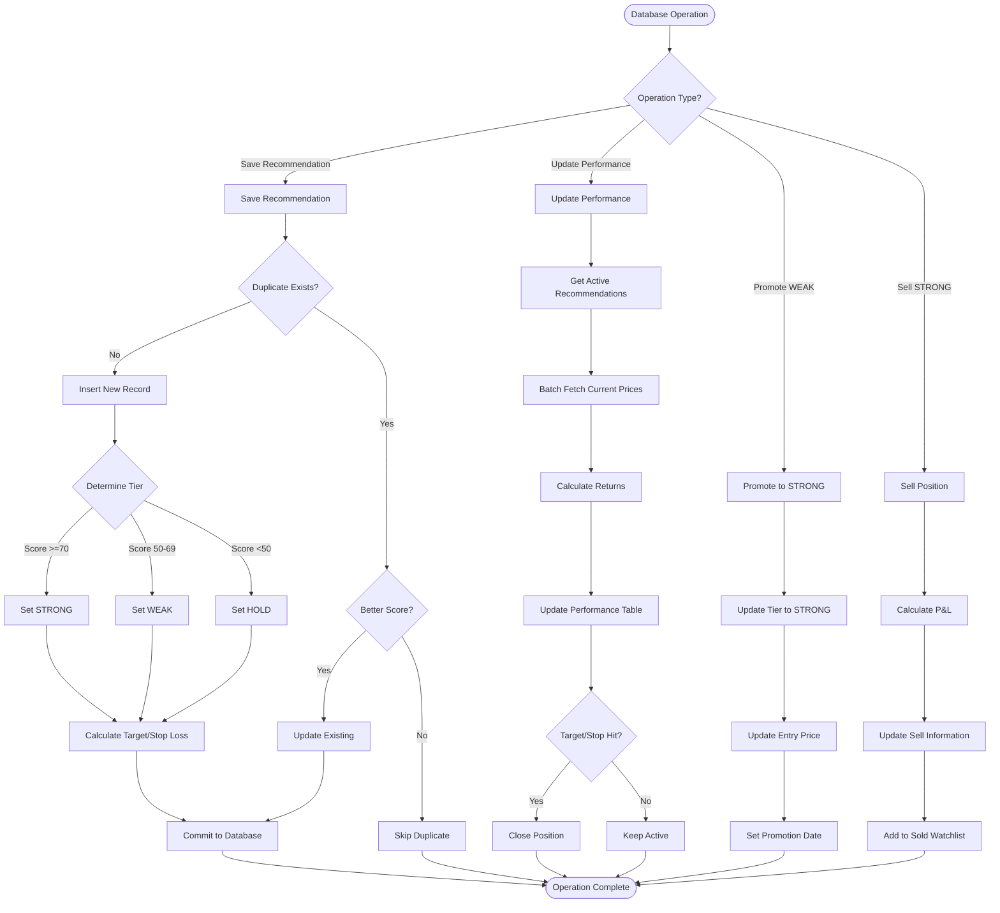
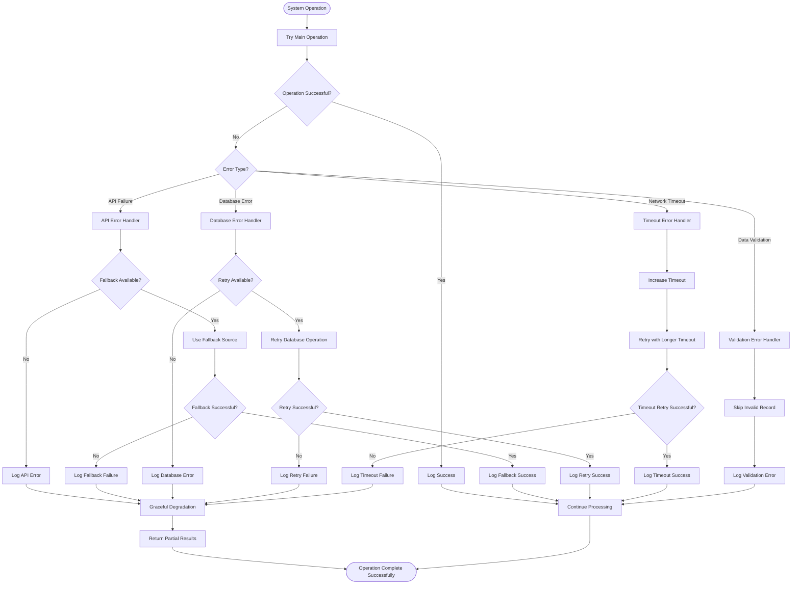

# System Flow Diagrams

## 1. Overall System Architecture Flow

## 2. Daily Monitoring Flow (Monday-Thursday)

## 3. Friday Analysis Flow

## 4. Weekly Analysis System Flow

## 5. Technical Indicator Calculation Flow

## 6. Buy/Sell Signal Analysis Flow

```mermaid
flowchart TD
    Start([Signal Analysis]) --> GetIndicators[Get Technical Indicators]
    GetIndicators --> TrendAnalysis[Analyze Trend Signals - 25%]
    
    TrendAnalysis --> DMA50{50-DMA Trend?}
    DMA50 -->|Uptrend| AddTrend8[+8 Points]
    DMA50 -->|Downtrend| SubTrend5[-5 Points]
    
    AddTrend8 --> DMA200{200-DMA Trend?}
    SubTrend5 --> DMA200
    DMA200 -->|Uptrend| AddTrend7[+7 Points]
    DMA200 -->|Downtrend| SubTrend3[-3 Points]
    
    AddTrend7 --> PriceVsDMA{Price vs 50-DMA?}
    SubTrend3 --> PriceVsDMA
    PriceVsDMA -->|Above| AddPrice5[+5 Points]
    PriceVsDMA -->|Below| SubPrice3[-3 Points]
    
    AddPrice5 --> GoldenCross{50-DMA vs 200-DMA?}
    SubPrice3 --> GoldenCross
    GoldenCross -->|Golden Cross| AddGold5[+5 Points]
    GoldenCross -->|Death Cross| SubGold5[-5 Points]
    
    AddGold5 --> MomentumAnalysis[Analyze Momentum - 20%]
    SubGold5 --> MomentumAnalysis
    
    MomentumAnalysis --> MACDCross{Recent MACD Crossover?}
    MACDCross -->|Bullish| AddMomentum12[+12 Points]
    MACDCross -->|Bearish| SubMomentum12[-12 Points]
    MACDCross -->|None| MACDHist{MACD Histogram?}
    
    AddMomentum12 --> RSIAnalysis[Analyze RSI - 15%]
    SubMomentum12 --> RSIAnalysis
    MACDHist -->|Strong Positive| AddHist5[+5 Points]
    MACDHist -->|Weak Negative| SubHist5[-5 Points]
    
    AddHist5 --> RSIAnalysis
    SubHist5 --> RSIAnalysis
    
    RSIAnalysis --> RSILevel{RSI Level?}
    RSILevel -->|30-45| AddRSI10[+10 Points - Oversold Recovery]
    RSILevel -->|45-65| AddRSI5[+5 Points - Healthy]
    RSILevel -->|65-75| SubRSI3[-3 Points - Getting Overbought]
    RSILevel -->|>75| SubRSI8[-8 Points - Overbought]
    RSILevel -->|<30| AddRSI8[+8 Points - Oversold]
    
    AddRSI10 --> VolumeAnalysis[Analyze Volume - 25%]
    AddRSI5 --> VolumeAnalysis
    SubRSI3 --> VolumeAnalysis
    SubRSI8 --> VolumeAnalysis
    AddRSI8 --> VolumeAnalysis
    
    VolumeAnalysis --> OBVTrend{OBV Trend?}
    OBVTrend -->|Strong Up >15%| AddOBV8[+8 Points]
    OBVTrend -->|Up 5-15%| AddOBV5[+5 Points]
    OBVTrend -->|Strong Down <-15%| SubOBV8[-8 Points]
    OBVTrend -->|Down -5 to -15%| SubOBV5[-5 Points]
    
    AddOBV8 --> VPTTrend{VPT Trend?}
    AddOBV5 --> VPTTrend
    SubOBV8 --> VPTTrend
    SubOBV5 --> VPTTrend
    
    VPTTrend -->|Strong Up >15%| AddVPT8[+8 Points]
    VPTTrend -->|Up 5-15%| AddVPT5[+5 Points]
    VPTTrend -->|Strong Down <-15%| SubVPT8[-8 Points]
    VPTTrend -->|Down -5 to -15%| SubVPT5[-5 Points]
    
    AddVPT8 --> PriceAction[Analyze Price Action - 15%]
    AddVPT5 --> PriceAction
    SubVPT8 --> PriceAction
    SubVPT5 --> PriceAction
    
    PriceAction --> RecentMomentum{Recent 4-week Avg Change?}
    RecentMomentum -->|>2%| AddPrice8[+8 Points - Strong]
    RecentMomentum -->|>0%| AddPrice4[+4 Points - Positive]
    RecentMomentum -->|<-2%| SubPrice8[-8 Points - Weak]
    RecentMomentum -->|<0%| SubPrice4[-4 Points - Negative]
    
    AddPrice8 --> WeightedScore[Calculate Weighted Scores]
    AddPrice4 --> WeightedScore
    SubPrice8 --> WeightedScore
    SubPrice4 --> WeightedScore
    
    WeightedScore --> TotalScore[Sum Total Score]
    TotalScore --> Recommendation{Score Range?}
    
    Recommendation -->|>=75| StrongBuy[STRONG BUY - Low Risk]
    Recommendation -->|60-74| Buy[BUY - Low-Medium Risk]
    Recommendation -->|40-59| WeakBuy[WEAK BUY - Medium Risk]
    Recommendation -->|20-39| Hold[HOLD - Medium-High Risk]
    Recommendation -->|<20| Sell[SELL - High Risk]
    
    StrongBuy --> Return[Return Analysis Result]
    Buy --> Return
    WeakBuy --> Return
    Hold --> Return
    Sell --> Return
```

## 7. Database Operations Flow

## 8. Error Handling and Resilience Flow

These flow diagrams provide a comprehensive view of how your stock monitoring and recommendation system operates, showing the detailed logic flow for each major component and their interactions.